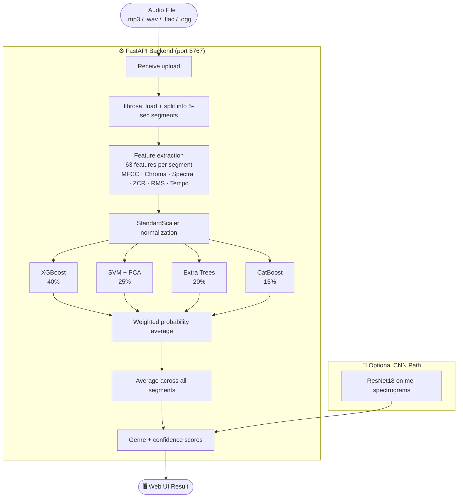

# Music Genre Classifier

An end-to-end machine learning system that classifies the genre of any audio file using handcrafted audio features and a weighted ensemble of four ML models. Upload a song through the web UI and get back the predicted genre with per-class confidence scores.

**Genres supported:** Blues · Classical · Country · Disco · Hip-Hop · Jazz · Metal · Pop · Reggae · Rock

---

## System Architecture



---

## Model Performance

| Model | Accuracy | Precision | Recall | F1 (macro) |
|---|---|---|---|---|
| Legacy Ensemble (model.pkl) | 79.5% | 79.2% | 80.5% | 79.5% |
| XGBoost | 79.0% | 78.7% | 79.9% | 79.0% |
| CatBoost | 77.0% | 77.2% | 78.2% | 77.2% |
| Weighted Ensemble | 76.5% | 76.2% | 77.9% | 76.4% |
| SVM | 75.5% | 75.0% | 77.0% | 75.5% |
| Extra Trees | 75.5% | 74.4% | 76.7% | 74.9% |

*Track-level evaluation on a held-out 20% split (group split by track ID to prevent data leakage).*

---

## Project Structure

```
ml-project/
├── backend/
│   ├── __init__.py
│   └── main.py              # FastAPI server — serves frontend + /predict endpoint
├── src/
│   ├── features/
│   │   ├── extraction.py    # Audio segmentation + 63 feature extraction (librosa)
│   │   └── extraction_snd.py
│   ├── prediction/
│   │   ├── predict.py       # Weighted ensemble inference
│   │   ├── predict_cnn.py   # ResNet18 CNN inference
│   │   └── predict_snd.py   # Drum sound prediction
│   ├── training/
│   │   ├── train.py         # Train XGBoost / SVM / ExtraTrees / CatBoost
│   │   └── train_snd.py
│   └── analysis/
│       ├── analyze_models.py    # Evaluate all models, save reports/
│       └── generate_diagram.py  # Generate architecture diagram PNG
├── frontend/
│   ├── index.html
│   ├── css/style.css
│   └── js/app.js
├── notebooks/
│   ├── 01_data_analysis.ipynb   # EDA + XGBoost baseline
│   ├── 02_cnn_training.ipynb    # ResNet18 CNN training
│   └── 03_dataset_builder.ipynb # Build feature CSV from raw audio
├── data/
│   ├── raw/                 # Raw WAV files (GTZAN dataset, git-ignored)
│   ├── processed/           # Extracted feature CSV (git-ignored)
│   └── sample_audio/        # A few songs for quick testing
├── models/                  # Saved model artifacts (.pkl / .pth)
├── reports/
│   └── model_analysis/      # Confusion matrices, ROC curves, F1 heatmaps
├── requirements.txt
└── run_project.sh
```

---

## Setup

```bash
git clone <repo-url>
cd ml-project

python3 -m venv venv
source venv/bin/activate      # Windows: venv\Scripts\activate
pip install -r requirements.txt
```

---

## Train models

```bash
python src/training/train.py
```

Expects `data/processed/music_5sec_features.csv` with `label` and `track_id` columns.
Saves all model artifacts to `models/`.

---

## Run the web app

```bash
python backend/main.py
```

Open `http://localhost:6767` — drag and drop any audio file.

---

## Evaluate all models

```bash
python src/analysis/analyze_models.py
```

Saves confusion matrices, ROC curves, F1 heatmaps, and a metrics CSV to `reports/model_analysis/`.

---

## Generate architecture diagram

```bash
python src/analysis/generate_diagram.py
```

Saves `reports/architecture_diagram.png` — ready for the written report.

---

## API Reference

| Method | Endpoint | Description |
|---|---|---|
| `GET` | `/` | Web UI |
| `GET` | `/health` | Service health check |
| `GET` | `/models` | Which models are available |
| `GET` | `/genres` | List all 10 supported genres |
| `POST` | `/predict` | Upload audio, returns genre + confidence |

### POST /predict

**Form fields:** `file` (audio file), `model_type` (`ml` or `cnn`)

**Response:**
```json
{
  "filename": "song.mp3",
  "predicted_genre": "hiphop",
  "confidence": 0.81,
  "all_probabilities": {
    "hiphop": 0.81,
    "pop": 0.09,
    "rock": 0.04,
    ...
  },
  "model_used": "ml"
}
```

---

## Dataset

**GTZAN Genre Collection** — 1000 audio tracks (100 per genre, 30 seconds each).  
Each track is split into six 5-second segments → 5985 samples after preprocessing.  
Features extracted with [librosa](https://librosa.org/): 13 MFCCs, 12 chroma, spectral centroid/bandwidth/rolloff/flatness, ZCR, RMS, tempo.

---

## Tech Stack

| Layer | Technology |
|---|---|
| Feature extraction | librosa, numpy |
| ML models | XGBoost, scikit-learn (SVM, ExtraTrees), CatBoost |
| CNN | PyTorch, ResNet18, torchaudio |
| Backend | FastAPI, uvicorn |
| Frontend | HTML / CSS / Vanilla JS |
